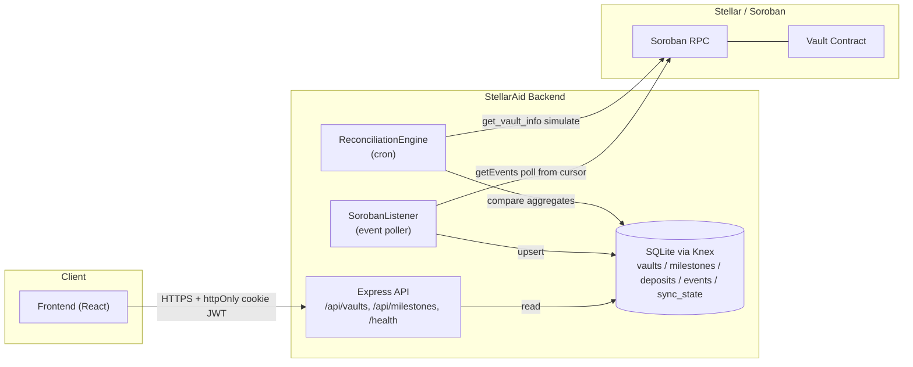

# StellarAid Backend

Indexer and API service for the **StellarAid** milestone-based charitable vault
built on Soroban. It watches the on-chain vault contract, projects its events
into a queryable database, exposes a read API for the frontend, and continuously
reconciles its off-chain view against authoritative on-chain state.

- Contracts: https://github.com/Stellar-Aid/Stellar-Aid-contracts
- Frontend: https://github.com/Stellar-Aid/Stellar-Aid-Frontend

---

## Overview

The companion Soroban vault contract manages donations against milestones with
multi-signature release approval:

- `initialize(admin, token, signers, required_sigs)`
- `deposit(donor, amount)`
- `add_milestone(caller, title, description, amount, recipient) -> id`
- `approve_milestone(signer, milestone_id)`
- `release_milestone(milestone_id)`
- `refund(donor)`
- Views: `get_milestone_status(id)`, `get_vault_info() -> (deposited, released, refunded)`, `get_donor_balance(donor)`
- `MilestoneStatus = Proposed | Active | Completed | Rejected`

This backend never signs or submits transactions on a user's behalf. All state
changes originate on-chain; the backend **derives** its data from ledger events
and only accepts write requests that carry a proof-of-submission `tx_hash`.

## Architecture



- **API** serves read models and one guarded write (propose milestone).
- **SorobanListener** polls `getEvents` from a persisted ledger cursor
  (`sync_state`), decodes events, and upserts into the DB.
- **ReconciliationEngine** periodically compares on-chain `get_vault_info` with
  DB aggregates and flags drift.

## Environment setup

Copy `.env.example` to `.env` and fill it in:

| Variable             | Description                                                        |
| -------------------- | ------------------------------------------------------------------ |
| `NETWORK`            | `testnet` or `mainnet`                                             |
| `RPC_URL`            | Soroban RPC endpoint URL                                          |
| `NETWORK_PASSPHRASE` | Must match the canonical passphrase for `NETWORK` (validated)     |
| `VAULT_CONTRACT_ID`  | Deployed vault contract id (`C...`)                               |
| `PORT`               | HTTP port (default `3000`)                                        |
| `JWT_SECRET`         | Secret for signing/verifying JWTs                                |
| `DB_FILE`            | SQLite file path (default `./stellaraid.db`)                      |

The server **fails fast** on boot if any required variable is missing or if
`NETWORK_PASSPHRASE` does not match the selected network.

## Run / build / test / migrate

```bash
npm install          # install dependencies
npm run migrate      # create/upgrade the SQLite schema
npm run dev          # start the API with hot reload (ts-node-dev)
npm run build        # compile TypeScript to dist/
npm start            # run the compiled server
npm test             # jest with coverage
npm run lint         # eslint (flat config, ESLint 9)
```

## API reference

| Method | Path                        | Auth | Description                                              |
| ------ | --------------------------- | ---- | -------------------------------------------------------- |
| GET    | `/health`                   | no   | Liveness probe                                           |
| GET    | `/api/vaults`               | no   | List vaults                                              |
| GET    | `/api/vaults/:id`           | no   | Vault detail incl. aggregates                            |
| GET    | `/api/vaults/:id/deposits`  | no   | Deposits for a vault                                     |
| GET    | `/api/milestones`           | no   | List milestones (`?vaultId=`, `?status=` filters)        |
| GET    | `/api/milestones/:id`       | no   | Single milestone                                         |
| POST   | `/api/milestones`           | yes  | Record a proposed milestone — **`tx_hash` required**     |

All responses wrap payloads as `{ "data": ... }`. Errors are shaped as
`{ "error": { "code", "message", "correlationId" } }`.

## Indexer & reconciliation design

- **Cursor persistence** — `sync_state(contract_id, last_ledger)` records the
  highest ledger scanned. Each poll requests `startLedger = last_ledger + 1` and
  advances to the RPC's reported `latestLedger`, so empty ranges are never
  re-scanned.
- **Event projection** — raw events are always stored in `events`; typed
  projection into `deposits` / `milestones` / `vaults` aggregates is driven by
  the event's `topic0` symbol (`deposit` / `milestone` / `release` / `refund`).
- **i128 safety** — all monetary amounts are stored as **strings** to preserve
  full Soroban i128 precision; never parsed into JS `number`.
- **Reconciliation** — a `node-cron` job re-reads `get_vault_info` on-chain and
  compares `(deposited, released, refunded)` to DB aggregates, logging any drift
  with the affected fields for operator follow-up.

> Note: low-level `scValToNative` event decoding and the aggregate projection
> are intentionally left as clearly-marked `TODO`s pending the finalized
> contract event ABI. The polling loop, cursor persistence, DB upserts, and cron
> wiring are fully implemented.

## Security posture

- **helmet** sets hardened HTTP headers on every response.
- **JWT in httpOnly cookies** — tokens are bearer credentials and must be stored
  by the client in `httpOnly; Secure; SameSite` cookies, **never** in
  `localStorage`/`sessionStorage`. The server also accepts an
  `Authorization: Bearer` header for service callers. Raw tokens are never
  logged, even on verification failure.
- **No secret / stack leakage** — the error handler returns opaque 500s to
  clients and logs full details server-side only.
- **Correlation IDs** — every error carries a UUID `correlationId` returned to
  the client and written to the server log for traceability.
- **Passphrase validation** — the process refuses to start if
  `NETWORK_PASSPHRASE` does not match the selected network, preventing
  wrong-network indexing.
- **Write guard** — the milestone write endpoint rejects any request lacking a
  submitted transaction `tx_hash`; the API never fabricates on-chain-derived
  state.

## Ecosystem Impact

StellarAid brings **verifiable, milestone-gated giving** to the Stellar
ecosystem. Donors can see exactly how funds move — every deposit, milestone
approval, release, and refund is derived from on-chain events, not from a
trusted operator's database. Multi-signature release control means funds are
only disbursed when the configured signers agree a milestone is met, reducing
misappropriation risk in humanitarian and charitable programs.

By publishing an open indexer + reconciliation service, StellarAid gives other
Stellar builders a reusable pattern for trustworthy off-chain projections:
cursor-based event sync, i128-safe accounting, and continuous on-chain/off-chain
drift detection. This lowers the bar for transparent, auditable financial
applications across the network and demonstrates Soroban's fitness for
real-world social-impact use cases.

## Repositories

- Contracts: https://github.com/Stellar-Aid/Stellar-Aid-contracts
- Frontend: https://github.com/Stellar-Aid/Stellar-Aid-Frontend
